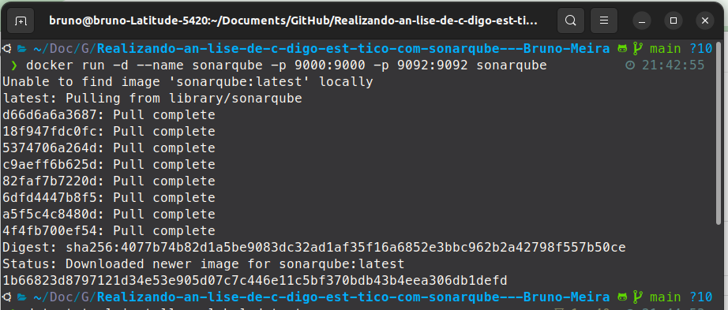
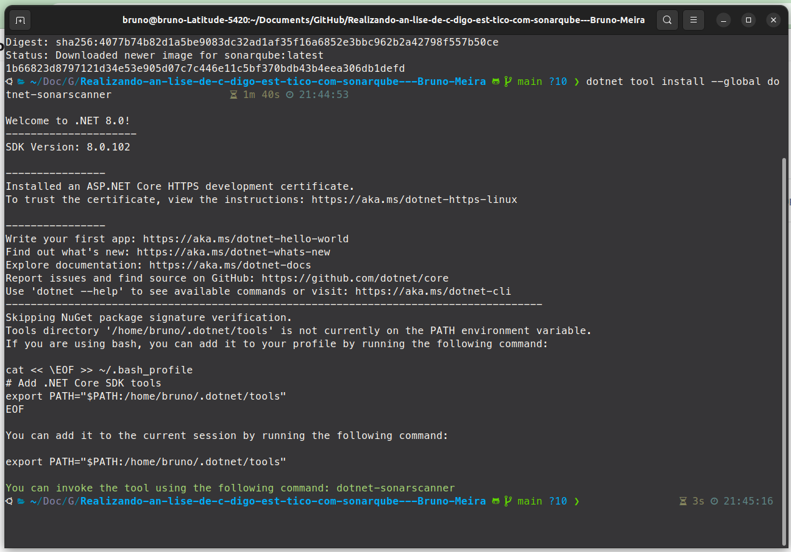
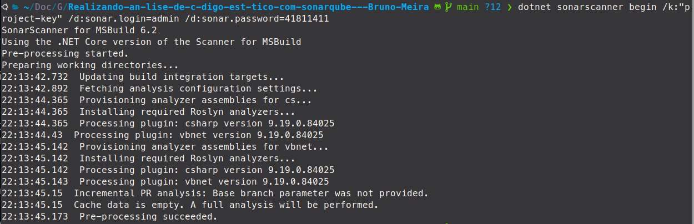
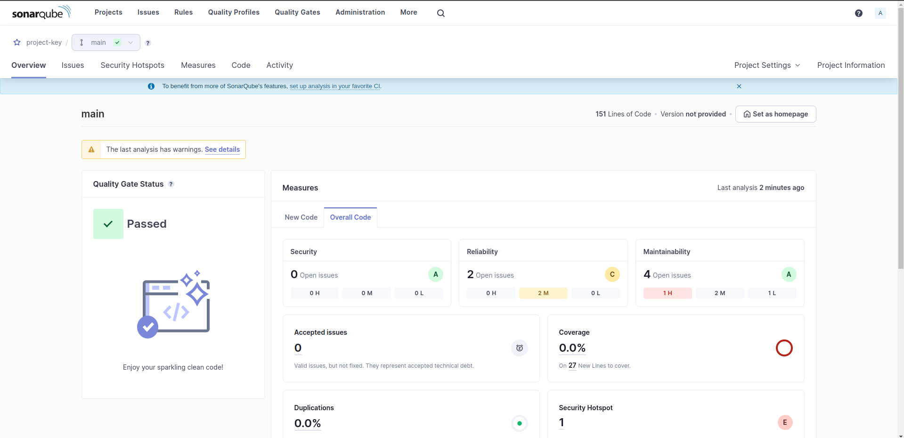
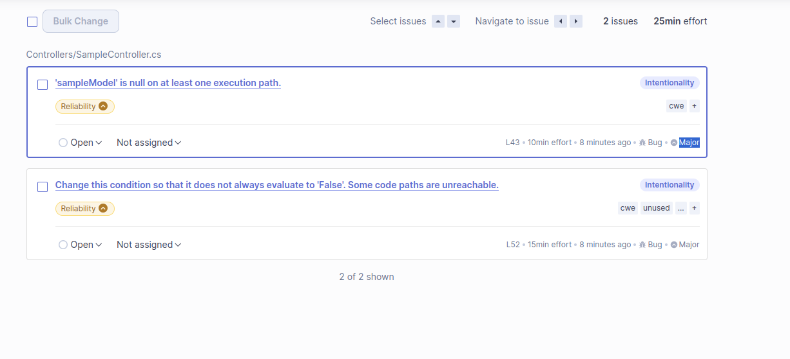
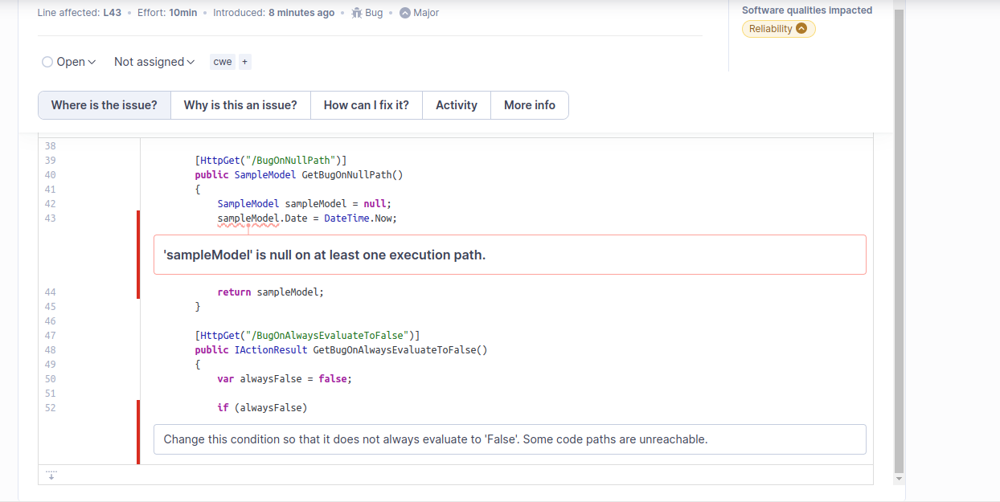
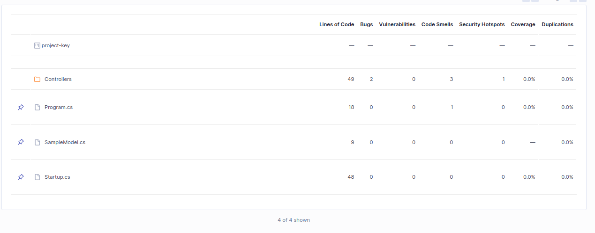
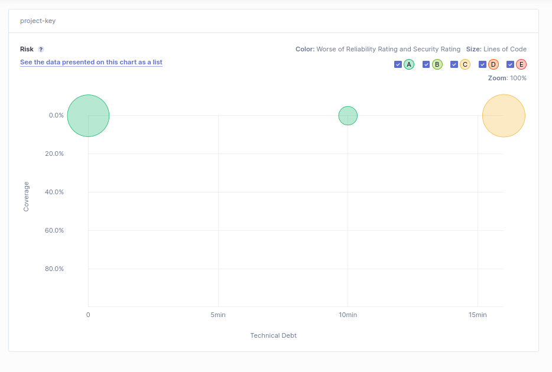

# Como Escrever Código Mais Limpo e Seguro com SonarQube, Docker e .NET Core

No artigo do autoestudo, aprendemos como utilizar o SonarQube, uma ferramenta de análise de código, em conjunto com Docker para analisar um aplicativo simples ASP.NET Core 3.0. O SonarQube é uma ferramenta poderosa para melhorar a qualidade e segurança do código, identificando problemas de segurança e bugs que podem passar despercebidos até impactar os usuários finais. Vamos revisar as tecnologias e conceitos aprendidos:

## Tecnologias Utilizadas

- **SonarQube**: Ferramenta de análise de código que ajuda a identificar problemas de qualidade e bugs no código.
- **Docker**: Plataforma que facilita a criação, implantação e execução de aplicativos em contêineres.
- **.NET Core**: Framework de desenvolvimento de software livre e de código aberto para a plataforma Windows, macOS e Linux.

## Passos do Artigo

1. **Preparar o Ambiente do SonarQube**: Instalar o Java SDK e o Docker.
2. **Configurar uma Aplicação de Exemplo**: Clonar um exemplo de aplicativo ASP.NET Core 3.0.
3. **Executar o SonarQube em Docker**: Iniciar o servidor SonarQube em um contêiner Docker.

4. **Instalar o SonarScanner para .NET Core**: Baixar e configurar o SonarScanner para análise do código .NET Core.

5. **Analisar o Código**: Executar o SonarScanner para analisar o código da aplicação.

6. **Visualizar os Resultados da Análise no SonarQube**: Acessar o SonarQube para ver os resultados da análise, incluindo bugs, vulnerabilidades e code smells.

## Conceitos Aprendidos

- **Quality Gate**: Define um padrão de qualidade aceitável para mesclar branches e lançar aplicativos em produção.
- **Análise de Código**: Apresentada de forma gráfica e transparente, permitindo que programadores e não programadores tenham visibilidade do progresso do código.
- **Insights de Código**: Ajuda a analisar bugs, vulnerabilidades de segurança e duplicação de código.
- **Priorização Rápida de Mudanças no Código**: Permite priorizar mudanças e melhorias no código de forma eficiente.
- **Customização de Regras**: Possibilidade de criar regras personalizadas para monitorar problemas específicos no código.

## Conceitos e funcionalidades do SonarQube

Aqui vou apresentar prints do SonarQube com detalhes e explicações de funcionalidade e possibilidades com essa tecnologia:

### Project Overview (Measures)

O SonarQube é uma plataforma de código aberto usada para realizar análises automáticas de código-fonte para detectar bugs, vulnerabilidades de segurança e "code smells" no código-fonte. Também pode ser usado para acompanhar métricas de qualidade do código ao longo do tempo. A imagem mostra vários indicadores-chave de qualidade:

Medidas (Measures): Esta seção é dividida entre "New Code" e "Overall Code" e fornece uma visão geral da qualidade do código, tanto recentemente adicionado quanto de todo o código existente.

Segurança (Security): Mostra o número de problemas de segurança abertos. Na imagem, indica 0 problemas, o que é positivo, recebendo uma classificação 'A' que é a mais alta.

Problemas Aceitos (Accepted issues): Indica problemas de código validados que não foram corrigidos e são considerados como dívida técnica aceita.

Confiabilidade (Reliability): Aponta para o número de bugs abertos que podem afetar a confiabilidade do código. Existem 2 problemas abertos indicados, que necessitam de atenção, como mostrado pela classificação 'C'.

Manutenibilidade (Maintainability): Indica problemas que afetam a capacidade de manter o código. Há 4 problemas abertos, com uma classificação 'A', embora haja 1 problema destacado como "H", que significa "High", indicando que é um problema grave.

Cobertura (Coverage): Mede a porcentagem do código que é coberto por testes automáticos. Neste caso, mostra 0.0% de cobertura em 27 novas linhas de código, o que é uma área de preocupação significativa para a qualidade do código.

Duplicações (Duplications): Indica a porcentagem de linhas de código duplicadas. A imagem mostra 0.0% de duplicações em 151 novas linhas de código, o que é bom pois indica que não há duplicações detectadas.

Ponto de Segurança (Security Hotspot): Representa áreas do código que precisam ser revisadas para potenciais vulnerabilidades de segurança. Há 1 ponto de segurança identificado para revisão.

Última análise: O canto superior direito indica que a última análise foi realizada há 2 minutos atrás.

Cada um desses indicadores ajuda as equipes de desenvolvimento a identificar e corrigir problemas no código antes que ele seja enviado para produção, melhorando a qualidade e a segurança do software.

### Reliability (Open Issues)

#### As Issues tem algumas caracteristicas:

- **Categoria:** Confiabilidade
- **Localização:** Linha 43
- **Esforço estimado para correção:** 10 minutos
- **Tempo desde a detecção:** 8 minutos atrás
- **Gravidade:** Bug Major (Grave)
- **Descrição:** Indica que a variável `sampleModel` pode ser nula em pelo menos um caminho de execução. Isso poderia levar a uma exceção de referência nula em tempo de execução se não for tratado corretamente.

Os problemas são classificados como 'Major', indicando que eles têm uma prioridade relativamente alta para correção, pois podem afetar a operação do programa de formas significativas. O SonarQube também fornece uma estimativa do esforço necessário para corrigir esses problemas, sugerindo que resolver ambos levaria aproximadamente 25 minutos no total.

Esses problemas também têm tags como `cwe` e `unused`, que são categorias padrão para classificar e entender a natureza do problema. `CWE` refere-se a Common Weakness Enumeration, que é um sistema de categorização de vulnerabilidades e bugs de software.

Adicionalmente, cada problema tem botões de ação como `Open` e `Not assigned`, indicando que o problema está aberto e ainda não foi atribuído a um desenvolvedor para resolução. A interface permite que as equipes gerenciem e atribuam problemas para garantir que sejam resolvidos de forma eficiente.

### Reliability or Maintainability (Example Code)

Nessa imagem tem o exemplo das issues e como Sonarqube aponta os erros do código, segue detalhes:

- **Linha afetada:** L43
- **Esforço estimado para correção:** 10 minutos
- **Introduzido:** 8 minutos atrás
- **Gravidade:** Bug Major (Grave)
- **Qualidades de software impactadas:** Confiabilidade
- **Descrição:** O problema identificado é que a variável `sampleModel` é inicializada como null, e em seguida, uma propriedade `Date` está sendo acessada nela. Isso levará a uma exceção de referência nula em tempo de execução, pois não é possível acessar propriedades ou métodos em um objeto nulo.
- **Solução Potencial:** Uma solução seria inicializar `sampleModel` apropriadamente antes de acessar suas propriedades ou adicionar uma verificação de nulidade antes de tentar acessar a propriedade `Date`.

#### Problema de Condição Sempre Falsa:

- **Linha afetada:** L52 (não visível na imagem, mas provavelmente abaixo do código mostrado)
- **Descrição:** Uma condição no código sempre resulta em false, o que significa que o caminho de código dentro do `if` nunca será executado.
- **Solução Potencial:** A condição ou a lógica deve ser revisada para que o caminho de código dentro do bloco `if` possa ser alcançado, quando apropriado.

São exemplos comuns de problemas que podem ocorrer em projetos de software e que o SonarQube é capaz de detectar. A ferramenta não apenas aponta onde no código os problemas existem, mas também fornece informações sobre por que são problemas e como potencialmente resolvê-los, o que é inestimável para manter a qualidade do código ao longo do tempo.

### Métricas de código

Imagem mostra as métricas de qualidade do código para diferentes componentes de um projeto de software:

#### Observações:

- **Controllers:** 2 bugs, 3 code smells, 1 security hotspot. Sem cobertura de testes ou duplicação.
- **Program.cs:** 1 code smell. Sem cobertura de testes ou duplicação.
- **SampleModel.cs:** Sem problemas identificados. Sem cobertura de testes ou duplicação.
- **Startup.cs:** Sem problemas identificados. Sem cobertura de testes ou duplicação.

Essas métricas ajudam as equipes de desenvolvimento a identificar áreas que precisam de atenção e melhorias, com foco em garantir que o código seja de alta qualidade, seguro, e mantenha um bom nível de manutenibilidade.

### Measures (Project Overview - Graph)

O gráfico de bolhas do SonarQube é utilizado para visualizar a saúde do código de um projeto em termos de cobertura de código e dívida técnica, bem como a gravidade das questões de confiabilidade e segurança. Vamos analisar os elementos do gráfico:

#### Eixos:

- Eixo X (Horizontal): Representa a 'Dívida Técnica', que é o tempo estimado para resolver todos os problemas de código identificados.
- Eixo Y (Vertical): Indica a 'Cobertura', que é a porcentagem do código que é coberto por testes.

#### Bolhas:

- Tamanho: O tamanho de cada bolha é proporcional ao número de linhas de código no componente correspondente do código-fonte.
- Cor: A cor de cada bolha indica a pior classificação entre as métricas de 'Confiabilidade' e 'Segurança', com as seguintes cores representando as classificações:
  - A (Verde): Ótimo
  - B (Azul claro): Bom
  - C (Amarelo): Regular
  - D (Laranja): Ruim
  - E (Vermelho): Muito Ruim

#### Interpretação:

- Bolhas localizadas mais para cima: Indicam uma maior cobertura de testes.
- Bolhas mais para a direita: Indicam uma maior dívida técnica.

Este gráfico é uma ferramenta importante para gestores de projeto e equipes de desenvolvimento para entender rapidamente onde focar os esforços de melhoria e garantir que o código permaneça saudável e sustentável ao longo do tempo.

## Conclusão

O uso do SonarQube em conjunto com Docker e .NET Core é uma prática valiosa para melhorar a qualidade e segurança do código. A análise contínua do código é essencial para identificar problemas e melhorar a qualidade do software. Com o SonarQube, é possível automatizar esse processo e garantir que o código atenda aos padrões de qualidade esperados.
